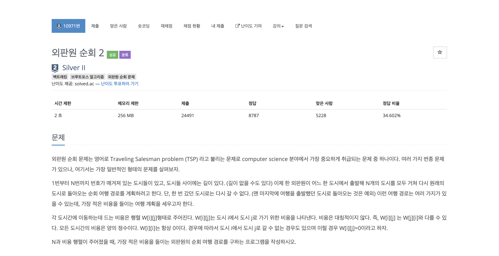
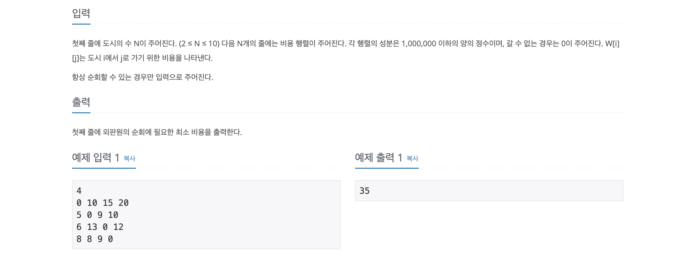
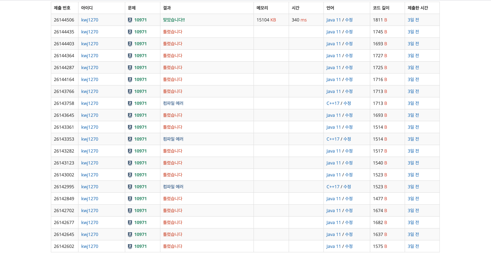

# 10971_외판원순회 2
> 말도 탈도 많았던 문제 😂     
   
   
    
         
모든 경로를 찾아서 그중에 최소비용을 찾는 문제이다.          
단, 마지막에서 처음위치로 다시 돌아가는 길이 0이면 안되며,      
거리를 탐색하는데 0인 곳은 못간다.       
당연한 말이겠지만, 마지막에 도착한 곳이 처음 출발한 곳이면 0의 값을 가지므로 경로에 포함되지 않는다.     
      
모든 순서에 대해서 찾아봐야하기에 브루트포스-순열을 이용했고     
이전에 `C++`로 풀어본적이 있지만, 절대 참고하지 않고 Java로 풀었다.    

```java
import java.io.BufferedReader;
import java.io.IOException;
import java.io.InputStreamReader;
import java.util.StringTokenizer;

public class Main {
    private static final BufferedReader BUFFERED_READER = new BufferedReader(new InputStreamReader(System.in));
    private static StringTokenizer stringTokenizer;
    private static int n;
    private static boolean[] isVisited;
    private static int[][] map;

    public static int nextPermutation(int start_index, int index, int result, int count){
        if(n-1 == count) {
            if(map[index][start_index] == 0) return Integer.MAX_VALUE;
            return result+map[index][start_index];
        }
        int answer = Integer.MAX_VALUE;
        for(int i=0; i < n; i++){
            if(isVisited[i] == true) continue;
            if(map[index][i] == 0) continue;
            isVisited[i] = true;
            answer = Math.min(answer, nextPermutation(start_index, i, result+map[index][i], count+1));
            isVisited[i] = false;
        }
        return answer;
    }

    public static void main(String[] args) throws IOException {
        n = Integer.parseInt(BUFFERED_READER.readLine().trim());
        isVisited = new boolean[n]; // false로 갱신되었지?
        map = new int[n][n];
        for(int i=0; i < n; i++){
            stringTokenizer = new StringTokenizer(BUFFERED_READER.readLine(), " ");
            for(int j=0; j < n; j++){
                map[i][j] = Integer.parseInt(stringTokenizer.nextToken());
            }
        }
        int result = Integer.MAX_VALUE;
        for(int i=0; i < n; i++){
            isVisited[i] = true;
            result = Math.min(result, nextPermutation(i, i, 0, 0));
            isVisited[i] =false;
        }
        System.out.println(result == Integer.MAX_VALUE ? 0 : result);
    }


}
```

# 주륵    

