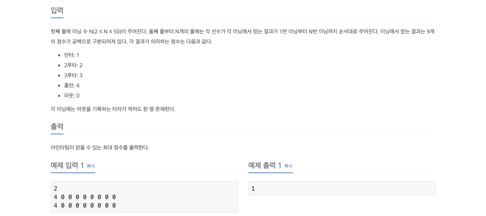

# 17281_⚾   





```c++
#include <iostream>
#include <algorithm>
#include <queue>

using namespace std;

// 1번 선수는 무조건 4번 타자

// 1.  2.    3.   4.     0
// 안타 2루타. 3루타. 4루타.  아웃.

// 선수 리스트에 대한 큐
// 순열 사용해서 1이 4번째일때만 동작하게끔 해야겠다.

// 이닝마다 루에 대한 큐 생성해줘야함
// 공 / 수 표시 없어도 됨
// 전체 스코어 표시해야함

int n;
vector<vector<int>> score;
vector<int> person;
int playGame(queue<int> &q, int inning, int point){
    if(inning == n) return point;
    int outCount = 0;
    queue<int> base;
    while (true) {
        if(outCount == 3) break;
        int player = q.front();
        int action = score[inning][player];
        q.push(player);
        q.pop();
        if(action == 0) {outCount++;}
        if(action == 1) {
            base.push(player);
            if(base.size() > 3){
                while (base.size()!=3) {
                    if(base.front() == -1) {base.pop(); continue;}
                    point++;
                    base.pop();
                }
            }
        }
        if (action == 2){
            base.push(player);
            base.push(-1);
            if(base.size() > 3){
                while (base.size()!=3) {
                    if(base.front() == -1) {base.pop(); continue;}
                    point++;
                    base.pop();
                }
            }
        }
        if (action == 3){
            base.push(player);
            base.push(-1);
            base.push(-1);
            if(base.size() > 3){
                while (base.size()!=3) {
                    if(base.front() == -1) {base.pop(); continue;}
                    point++;
                    base.pop();
                }
            }
        }
        if (action == 4){
            point++;
            while (!base.empty()) {
                if(base.front() == -1) {base.pop(); continue;}
                point++;
                base.pop();
            }
        }
    }
    return playGame(q,  inning+1, point);
}

int main() {
    int answer = 0; // 후에 max로 값 채움
    cin >> n; // 이닝 수
    person = {0,1,2,3,4,5,6,7,8}; // 순열 돌릴 예정.
    score.resize(n, vector<int>(9, 0));
    
    for(int i = 0; i < score.size(); i++){
        for(int j=0; j < 9; j++){
            cin >> score[i][j];
        }
    }

    do {
        if(person[3] != 0) continue;
        queue<int> q;
        for(int i=0; i < person.size(); i++){ q.push(person[i]);}
        answer = max(answer, playGame(q, 0, 0));
    } while (next_permutation(person.begin(), person.end()));
    
    cout << answer << "\n";
    
    return 0;
}

```
